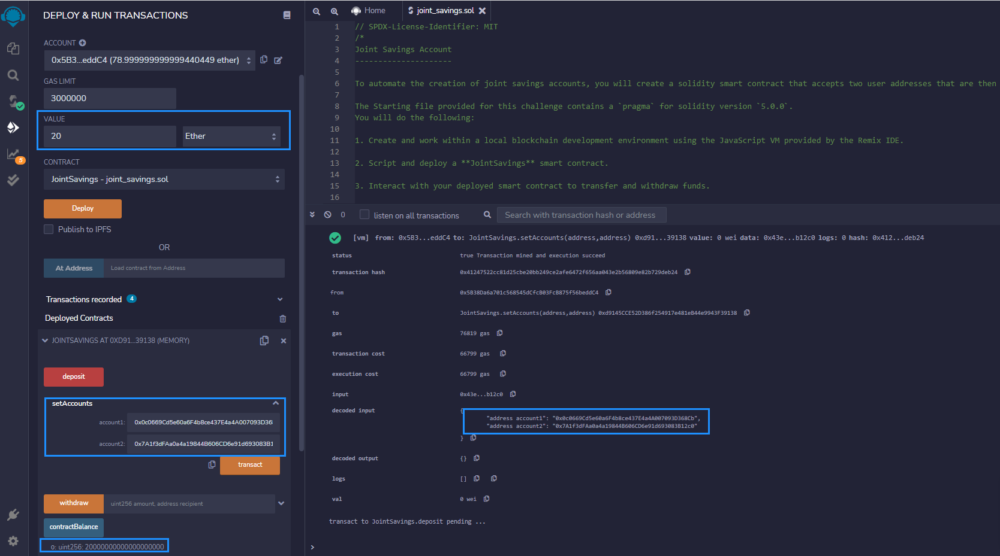
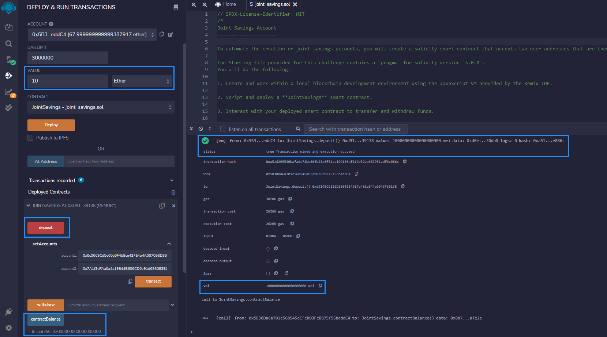

# Solidity-JointSavings-smart-contract
Create a Solidity smart contract that accept two user addresses to automate the creation of joint savings accounts.


The steps for this project are divided into the following sections:

1. Create a Joint Savings Account Contract in Solidity
2. Compile and Deploy Your Contract in the JavaScript VM
3. Interact with Your Deployed Smart Contract


---

## Technologies

We will use [Remix IDE website](https://remix.ethereum.org/#optimize=false&runs=200&evmVersion=null&version=soljson-v0.8.7+commit.e28d00a7.js) to build and test smart contracts. We will not need to install anything for this project. 

---

## Usage

You will need to clone the repo so that you can run the application:

```
https://github.com/locthai2002/Solidity-JointSavings-smart-contract.git

```

Here are some screenshots from running the application:

## Compile the Contract


## Set Up Joint Accounts



## Deposit 20 Ether


## Deposit 1 Ether


## Deposit 10 Ether



## Deposit 5 Ether


## Withdraw 1 Ether


## Withdraw 5 Ether


## Withdraw 10 Ether


---

## Contributors

Loc Thai -- www.linkedin.com/in/loc-thai-69b8a2141
Phone: 415.400.9998

---

## License

MIT
